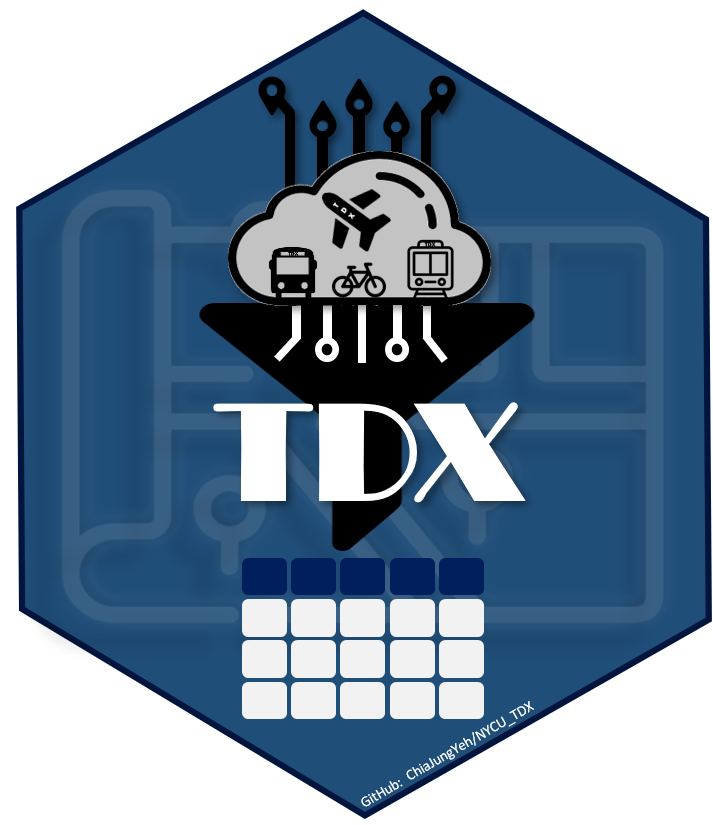

## Overview

This package can be used to connect transportation data from TDX
(Transport Data eXchange) in a neat and efficient way in Python. TDX platform is
supported by Ministry of Transportation and Communications (MOTC) in
Taiwan, which provides lots of API for the members download the
transportation data. Before using the function provided in this package,
the authentication key is a must, which can be applied from [TDX
platform](https://tdx.transportdata.tw/register). After being a member
of TDX, you will soon get the Client Id and Client Secret, please check
out in the [API key
Dashboard](https://tdx.transportdata.tw/user/dataservice/key).

If you are R user, please install the packages on Github via `devtools::install_github("ChiaJung-Yeh/NYCU_TDX")`,
and all of the functions can be found in  **[TDX
Guide](https://chiajung-yeh.github.io/TDX_Guide/)** website.

## Installation

Please install the package via following pip code.

    pip install nycu-tdx-py

## Usage

Data retrieving process requires an access token to obtain the data from
TDX platform. Every function in this package should use function
`get_token()` to obtain the token by entering your Client ID and Client
Secret first. Note that the access token will expire in 1 day.

Take retrieving bus stops of Taipei City for example. The
code is shown below. Here the argument `client_id` and `client_secret`
is the authentication key applied from TDX.

    from nycu_tdx_py import tdx
    
    # get the access token first
    access_token=tdx.get_token("CLIENT_ID", "CLIEN_SECRET")

    # retrieve Taipei bus stops
    taipei_bus=tdx.BusStopOfRoute(access_token, "Taipei")

## Support

This package takes advantage of API service provided by TDX, MOTC.

## Contact

For questions, bugs, and other discussion, please feel free to contact
the package maintainer, Chia Jung, Yeh.  
Email:
<a href="mailto:robert1328.mg10@nycu.edu.tw"><u><robert1328.mg10@nycu.edu.tw></u></a>
